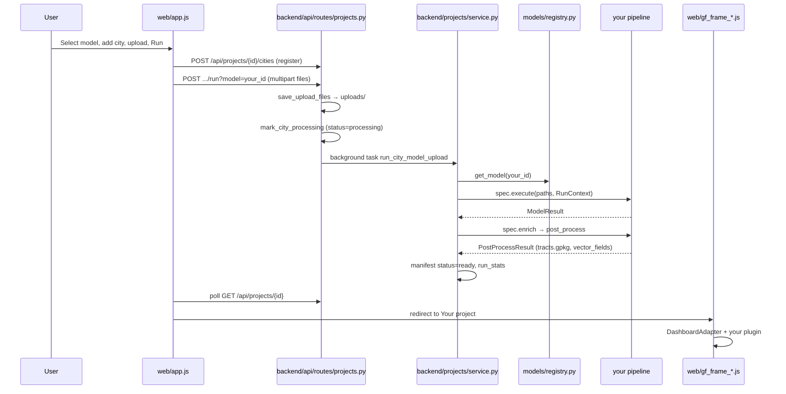

# Adding an analysis model

Comprehensive end-to-end guide for registering a new geospatial analysis model in the Geospatial GUI.

A model spans **three layers** that must agree on the same `id` (e.g. `ndvi`):

| Layer | Location | What it does |
|-------|----------|--------------|
| **Backend pipeline** | `models/your_model.py` | Runs on uploaded files, writes artifacts, joins results to census tracts |
| **API exposure** | `models/registry.py` | Auto-registers `GET /api/models`; existing run routes accept `?model=your_id` |
| **Frontend plugin** | `web/plugins/your_plugin.js` | Map colors, legends, bar charts, Ask labels, chat hints |

**Reference implementations today:**

| Model | Backend | Core pipeline | Zonal join | Frontend plugin |
|-------|---------|---------------|------------|-----------------|
| LST | `models/lst_model.py` | `models/lst_pipeline.py` | `backend/pipelines/lst_zonal.py` | `web/plugins/lst_plugin.js` |
| OBIA | `models/obia_model.py` | `models/obia_core.py` | `backend/pipelines/obia_zonal.py` | `web/plugins/obia_plugin.js` |

---

## Table of contents

0. [Local dev setup](#local-dev-setup)
1. [Before you start](#before-you-start)
2. [Architecture overview](#architecture-overview)
3. [Quick checklist](#quick-checklist)
4. [Part 1 — Backend](#part-1--backend)
5. [Part 2 — Frontend plugin](#part-2--frontend-plugin)
6. [Part 3 — Ask tab integration](#part-3--ask-tab-integration)
7. [Part 4 — Dashboard integration](#part-4--dashboard-integration)
8. [Part 5 — Chat, comparison, and PDF](#part-5--chat-comparison-and-pdf)
9. [Part 6 — Manifest and API](#part-6--manifest-and-api)
10. [Part 7 — Testing and debugging](#part-7--testing-and-debugging)
11. [Part 8 — Worked example (NDVI, end-to-end)](#part-8--worked-example-ndvi-end-to-end)
12. [Part 9 — Design guidelines](#part-9--design-guidelines)
13. [Part 10 — File map](#part-10--file-map)
14. [Related docs](#related-docs)

---

## Local dev setup

Do this **once** before adding a model. If any step fails, fix it before writing new code.

### 1. Install dependencies

From the project root (`Geospatial-GUI-1/`):

```bash
pip install -r requirements.txt
```

Requires **Python 3.10+** (64-bit recommended for geospatial wheels).

### 2. Configure environment

**Windows:**

```bash
copy .env.example .env
```

**macOS / Linux:**

```bash
cp .env.example .env
```

Edit `.env` and set at minimum:

```env
CENSUS_API_KEY=your_key_here
```

Free key: https://api.census.gov/data/key_signup.html

The census key is required for tract boundaries and ACS demographics on the dashboard. Without it, `post_process` may fail when loading tracts.

### 3. Start the server

```bash
python serve.py
```

You should see:

```text
Open: http://127.0.0.1:8765/
```

Open that URL in a browser. API docs: http://127.0.0.1:8765/docs

**If port 8765 is already in use:** another `python serve.py` is still running. Close that terminal or end the process, then start again.

### 4. Verify the stack (before you add code)

| Check | How |
|-------|-----|
| Server healthy | http://127.0.0.1:8765/ loads the Ask page |
| Models registered | http://127.0.0.1:8765/api/models returns `lst` and `obia` |
| Census works | Demo tab → pick a city → tract map shows demographics (not all `—`) |
| Registry import | `python -c "from models.registry import list_models; print([m.id for m in list_models()])"` |

After you add a model, **restart `python serve.py`** (no auto-reload) and **hard-refresh** the browser (`Ctrl+Shift+R`), or bump `?v=` on changed JS files in `web/index.html`.

**Windows users:** see [SETUP_WINDOWS.md](SETUP_WINDOWS.md) for a full walkthrough.

---


### Prerequisites

- Working local dev environment 
- Familiarity with GeoPandas / Rasterio (tract zonal stats or vector overlay)
- A **US city address** (`City, ST`) whose census tracts overlap your raster extent
- `CENSUS_API_KEY` in `.env` (required for tract boundaries and ACS demographics on the dashboard)

### Choose your integration path

| Your output | Recommended path | Dashboard |
|-------------|------------------|-----------|
| Per-tract numeric field (mean LST, mean NDVI, …) | `vector_join: "tract_zonal"` + continuous choropleth | Heat & Equity (`equity`) |
| Per-tract categorical field (dominant land-cover class) | `vector_join: "tract_zonal"` + categorical choropleth plugin | Heat & Equity (`equity`) |
| Scene-level stats only (no tract map) | Possible but **not supported well** — equity frame expects tract GeoJSON | Avoid for now |

The backend contract (`models/contract.py`) only declares `dashboard: "equity"` today. Plan on producing enriched `tracts.gpkg` / `tracts.geojson` under each city folder.

### Model id conventions

- Lowercase slug: `ndvi`, `fire_risk`, `urban_growth`
- Must match across: `ModelSpec.id`, registry key, plugin `id`, `?model=` query param, `analysis_model` in chat context
- No spaces; use underscores for multi-word ids

---

## Architecture overview

### End-to-end sequence



### City status state machine

| Status | Meaning | Set by |
|--------|---------|--------|
| `pending` | City registered, no successful run yet | `register_city()` |
| `processing` | Upload received; background run in progress | `mark_city_processing()` |
| `ready` | Pipeline + post_process succeeded | `run_city_model_upload()` |
| `error` | Exception during run; see `city.error` | `run_city_model_upload()` |

The Ask tab polls `GET /api/projects/{id}` every few seconds until the city is `ready` or `error`.

### Component map

```
models/
  contract.py          # ModelSpec, RunContext, ModelResult, PostProcessResult
  registry.py          # _MODELS dict — register here
  your_core.py         # heavy pipeline logic (recommended)
  your_model.py        # ModelSpec instance + run/post_process hooks

backend/
  projects/
    dispatch.py        # run_model() → spec.execute()
    service.py         # run_city_model_upload(), manifest I/O
    compare.py         # cross-city ranking for chat (METRIC_ALIASES)
  pipelines/
    your_zonal.py      # enrich_tracts_with_* (recommended)
  chat/
    dashboard.py       # Ollama system prompts per analysis_model
  core/
    uploads.py         # ALLOWED_UPLOAD_SUFFIXES validation
    constants.py       # RASTER_SUFFIXES, SHAPEFILE_SUFFIXES, TRACT_LAYER

web/
  model_plugin.js      # createPlugin() factory
  plugins/your_plugin.js
  dashboard_adapter.js # plugin registry + merge with GET /api/models
  app.js               # Ask tab, MODEL_RUN_STEPS, progress polling
  gf_frame_shared.js   # adapter wiring, bar chart, city list
  gf_frame_map.js      # MapLibre choropleth, legend, popups
  gf_frame_chat.js     # follow-up chat context
```

### On-disk layout (per city)

```
data/projects/{project_id}/
  manifest.json
  cities/{city_key}/
    uploads/              # saved multipart files
    ndvi_output/          # your pipeline artifacts (convention)
    tracts.gpkg           # census + your columns (layer: tracts)
    tracts.geojson        # MapLibre source
```

---

## Quick checklist

- [ ] **1.** Implement core pipeline (`models/your_core.py`)
- [ ] **2.** Add zonal join (`backend/pipelines/your_zonal.py`) if tract-based
- [ ] **3.** Create `models/your_model.py` (`ModelSpec`, `run`, `post_process`)
- [ ] **4.** Register in `models/registry.py`
- [ ] **5.** (Optional) Add env vars to `.env.example`
- [ ] **6.** (Optional) Add `METRIC_ALIASES` in `backend/projects/compare.py`
- [ ] **7.** (Optional) Add chat system prompt in `backend/chat/dashboard.py`
- [ ] **8.** Restart `python serve.py` — verify `GET /api/models`
- [ ] **9.** Create `web/plugins/your_plugin.js`
- [ ] **10.** Register in `web/dashboard_adapter.js`; bump `?v=` in `index.html`
- [ ] **11.** (Optional) Add `MODEL_RUN_STEPS.your_id` in `web/app.js`
- [ ] **12.** Smoke test full Ask → dashboard → chat flow
- [ ] **13.** Document in [MODELS.md](MODELS.md) and [CHANGELOG.md](../CHANGELOG.md)

---

## Part 1 — Backend

### 1.1 Contract (`models/contract.py`)

#### `ModelSpec` fields

| Field | Required | Purpose |
|-------|----------|---------|
| `id` | Yes | URL slug (`?model=ndvi`) |
| `label` | Yes | Ask dropdown label |
| `description` | Yes | API / docs text |
| `input_schema` | Yes | `InputField` tuple — Ask upload hints |
| `dashboard` | Yes | `"equity"` (only wired type) |
| `vector_join` | Yes | `"tract_zonal"` or `"none"` |
| `vector_fields` | Yes | Tract column names for map + chat |
| `primary_metric` | Yes | Key in `run_stats` for charts and comparison |
| `pick_primary` | If multi-file | Pick main raster from mixed uploads |
| `run` | Yes | `(paths, RunContext) → ModelResult` |
| `post_process` | Strongly recommended | `(ModelResult, RunContext) → PostProcessResult` |

#### `RunContext`

| Field | Path / meaning |
|-------|----------------|
| `address` | `"Round Rock, TX"` |
| `city_dir` | `data/projects/{id}/cities/{key}/` |
| `uploads_dir` | `city_dir/uploads/` |
| `city_layers_cache` | `data/city_layers_cache/` |

#### `ModelResult`

| Field | Stored as |
|-------|-----------|
| `stats` | `run_stats` in manifest (must be JSON-serializable) |
| `logs` | `run_logs` (truncated to 8k chars) |
| `artifacts` | Not stored directly — use in `post_process` |
| `primary_raster` | `primary_raster` filename in manifest |

Use `backend.core.json_util.to_json_safe()` patterns if stats contain numpy types.

#### `PostProcessResult`

| Field | Purpose |
|-------|---------|
| `enriched_gdf` | Written to `tracts.gpkg` / `tracts.geojson` by your zonal helper |
| `stats_updates` | Merged into `run_stats` (e.g. tract-level means, warnings) |
| `vector_fields` | Full column list on tract layer (include census fields) |
| `city_fields` | `summary`, `map_layers`, `geocode`, `bounds_wgs84` |

**Standard census columns** — always include `VECTOR_QUERY_FIELDS` from `backend/layers/orchestrator.py`:

```
GEOID, acs_name, population, median_income_usd, hispanic_pct, black_pct, population_density_per_km2
```

### 1.2 Implement `run`

Separate **pipeline logic** from **wiring**:

```
models/ndvi_core.py     ← raster math, file I/O
models/ndvi_model.py    ← pick files, call core, return ModelResult
```

**Rules:**

- Raise `ValueError` with actionable messages — they become `city.error` in the UI
- Write outputs under `ctx.city_dir` (e.g. `ctx.city_dir / "ndvi_output"`)
- Put durable paths in `artifacts` for `post_process`
- Capture stdout into `logs` if useful (OBIA uses `contextlib.redirect_stdout`)

**Multi-file uploads:** All files land in one list. Sort by extension:

```python
# Pattern from models/obia_model.py
from backend.core.constants import RASTER_SUFFIXES

def _pick_raster(paths: list[Path]) -> Path:
    rasters = [p for p in paths if p.suffix.lower() in RASTER_SUFFIXES]
    if not rasters:
        raise ValueError("Upload at least one GeoTIFF.")
    return max(rasters, key=lambda p: p.stat().st_size)
```

### 1.3 Allowed upload types

Validated in `backend/core/uploads.py` via `ALLOWED_UPLOAD_SUFFIXES`:

| Category | Extensions |
|----------|------------|
| Rasters | `.tif`, `.tiff`, `.geotiff`, `.gtiff` |
| Shapefile sidecars | `.shp`, `.shx`, `.dbf`, `.prj`, `.cpg`, `.sbn`, `.sbx` |

To support new formats (e.g. `.nc`, `.zip`), extend `backend/core/constants.py` and document the change.

### 1.4 Implement `post_process` (tract zonal join)

**Required for equity dashboard.** Pattern used by LST and OBIA:

1. `load_city_layers(address, cache_dir=ctx.city_layers_cache)` — fetches TIGER + ACS
2. Read cached tracts: `geojson/{cache_key}.geojson` or `gpkg/{cache_key}.gpkg` layer `tracts`
3. Run zonal helper → add your columns
4. Write `ctx.city_dir / "tracts.gpkg"` and `tracts.geojson`
5. Return `PostProcessResult`

**Numeric rasters (LST-style)** — `backend/pipelines/lst_zonal.py`:

- Reproject tracts to raster CRS
- `rasterio.mask.mask` per tract polygon
- Compute mean/max per tract

**Vector segments (OBIA-style)** — `backend/pipelines/obia_zonal.py`:

- `gpd.overlay` tracts × segments
- Area-weighted mode class per tract

#### CRS handling (critical for raster zonal joins)

Census tracts from the server are stored in **WGS84** (`EPSG:4326`). Your output raster may use a **projected** CRS (e.g. `EPSG:32614` UTM). If you mask tracts in the wrong CRS, pixels will not align and every tract gets `null` — the map looks empty with no obvious error.

**Rule:** always reproject **tract polygons to the raster CRS** before `rasterio.mask.mask`, not the other way around.

```python
# backend/pipelines/ndvi_zonal.py (and lst_zonal.py)
gdf = tract_gdf.copy()
if gdf.crs is None:
    gdf = gdf.set_crs("EPSG:4326")   # census cache default

with rasterio.open(ndvi_tif) as src:
    raster_crs = src.crs
    gdf_proj = gdf.to_crs(raster_crs)  # ← required step
    for geom in gdf_proj.geometry:
        data, _ = mask(src, [geom], crop=True, nodata=np.nan)
        # ...
```

**How to debug CRS/extent issues:**

```python
import rasterio
import geopandas as gpd

with rasterio.open("path/to/ndvi.tif") as src:
    print("Raster CRS:", src.crs)
    print("Raster bounds:", src.bounds)  # in raster CRS units (usually metres)

tracts = gpd.read_file("data/city_layers_cache/geojson/CACHE_KEY.geojson")
tracts_proj = tracts.to_crs(src.crs)
print("Tract bounds (raster CRS):", tracts_proj.total_bounds)
# Bounds should overlap. If they don't, register a different city or move the raster.
```

**Common mistakes:**

| Mistake | Symptom |
|---------|---------|
| Mask in WGS84 while raster is UTM | All tract values `null` |
| Raster covers Brazil, city is `Dallas, TX` | `tract_zonal_warning`, empty choropleth |
| Raster missing CRS (no `.prj` / tags) | Wrong reprojection or failed mask |
| Using scene-wide stats only, skipping zonal join | Map shows census layers but not your metric |

**Warnings:** If no values overlap tracts, set in `stats_updates`:

```python
stats_updates["tract_zonal_warning"] = (
    "No NDVI values overlap census tracts — check raster extent vs registered city."
)
```

The dashboard surfaces this via `DashboardAdapter.cityRunWarning()`.

### 1.5 Register in `models/registry.py`

```python
from models.ndvi_model import NDVI_MODEL

_MODELS: dict[str, ModelSpec] = {
    LST_MODEL.id: LST_MODEL,
    OBIA_MODEL.id: OBIA_MODEL,
    NDVI_MODEL.id: NDVI_MODEL,
}
```

Import errors here prevent the server from starting — run `python serve.py` and watch the terminal.

### 1.6 Input schema

`input_schema` drives Ask UI via `GET /api/models`:

| `InputField` | Effect |
|--------------|--------|
| `name` | Logical group id (informational) |
| `label` | File drop title (first field wins in `fileDropTitle`) |
| `accept` | Combined for browser filter (`dashboard_adapter.inputAccept`) |
| `hint` | Help text under drop zone |
| `required` | Documented in API schema |

**Note:** All files are sent as multipart field `files` — the server does not enforce per-field separation. Your `run()` must classify uploads.

### 1.7 Environment variables

```python
import os
SEGMENTS = int(os.environ.get("YOUR_MODEL_SEGMENTS", "1000"))
```

Document in `.env.example`, [DATA.md](DATA.md), and your [MODELS.md](MODELS.md) section.

### 1.8 Service layer (what you do *not* edit for a standard model)

`backend/projects/service.py` → `run_city_model_upload()`:

1. Builds `RunContext`
2. Calls `run_model()` → your `run`
3. Merges `post_process` stats into `run_stats`
4. Sets `status: ready`, `vector_fields`, `lst_stats` alias
5. On exception: `status: error`, `error: str(exc)`

`backend/api/routes/projects.py` runs this in a **FastAPI BackgroundTask** so the HTTP response returns immediately with `status: processing`.

---

## Part 2 — Frontend plugin

### 2.1 Minimal working plugin

This is enough for Ask labels, bar chart, map choropleth, and tract popups (using `createPlugin` defaults for legend/paint):

```javascript
// web/plugins/ndvi_plugin.js
import { createPlugin } from "../model_plugin.js";

export default createPlugin({
  id: "ndvi",
  presentation: {
    // --- Required for a usable dashboard ---
    choroplethField: "ndvi_mean",
    primaryMetricKeys: ["ndvi_mean", "tract_mean_ndvi"],
    runVerb: "NDVI",

    // --- Strongly recommended (Ask + map labels) ---
    runProgressStart: "Starting NDVI analysis on the server…",
    runProgressWorking: "Still working — NDVI can take a few minutes for large scenes.",
    barChartLabelProject: "Mean NDVI",
    barChartHeadingProject: "Mean NDVI by city",
    analysisLayerLabel: "NDVI",
    legendLabel: "NDVI",
    metricUnit: "",

    // --- Recommended for chat ---
    chatContextSummary:
      "NDVI vegetation index for {city}. Per-tract column: ndvi_mean. " +
      "Combine with median_income_usd and population for equity questions. " +
      "This is vegetation greenness, not land surface temperature.",

    // --- Optional polish (defaults exist in dashboard_adapter.js) ---
    cardTitle: "Run NDVI for a city",
    portfolioHint: "Upload a multispectral GeoTIFF whose red and NIR bands match your pipeline.",
    fileDropTitle: "Multispectral GeoTIFF",
    tractDetailLabel: "Mean NDVI",
    chatAnalysisLabel: "NDVI vegetation index",
  },
});
```

Register in `web/dashboard_adapter.js`:

```javascript
import ndviPlugin from "./plugins/ndvi_plugin.js";

[lstPlugin, obiaPlugin, ndviPlugin].forEach((plugin) => {
  PLUGINS[plugin.id] = plugin;
});
```

Bump the cache-bust query in `web/index.html` so browsers fetch the new module:

```html
<script type="module" src="dashboard_adapter.js?v=7"></script>
```

Changing `?v=6` → `?v=7` forces a fresh download (see [Cache busting](#cache-busting) below).

#### Cache busting

Browsers cache static JS files. After editing `dashboard_adapter.js` or a plugin, either:

- Hard-refresh: `Ctrl+Shift+R`, or
- Increment `?v=N` on the changed `<script>` tag in `index.html`

### 2.2 Presentation fields — required vs optional

Merged in `mergePresentation()`: API spec → plugin `presentation` → `DEFAULT_PRESENTATION` in `dashboard_adapter.js`.

| Key | Required? | Used by | Notes |
|-----|-----------|---------|-------|
| `id` (on plugin root) | **Yes** | Registry lookup | Must match `ModelSpec.id` |
| `choroplethField` | **Yes** | Map tract fill | Must match a column in `tracts.gpkg` |
| `primaryMetricKeys` | **Yes*** | Bar chart, city badge | *Or rely on API `primary_metric` only |
| `runVerb` | **Yes** | Ask run button | e.g. `"Run NDVI for city"` |
| `runProgressStart` | Recommended | Ask progress bar | Generic fallback exists in `app.js` |
| `runProgressWorking` | Recommended | Ask progress bar | Generic fallback exists |
| `barChartLabelProject` | Recommended | Cross-city bar chart | Default: `"Primary metric"` |
| `barChartHeadingProject` | Recommended | Bar chart title | |
| `analysisLayerLabel` | Recommended | Layer toggle | Default: `"Analysis result"` |
| `legendLabel` | Recommended | Legend title | Used in generic key queries |
| `metricUnit` | Optional | Value formatting | e.g. `"°C"`; empty for unitless NDVI |
| `chatContextSummary` | Recommended | Chat system context | `{city}` is replaced at runtime |
| `chatAnalysisLabel` | Optional | Suggested query prompts | |
| `cardTitle` | Optional | Ask card heading | |
| `portfolioHint` | Optional | Ask portfolio text | |
| `fileDropTitle` | Optional | Upload zone | API `input_schema.label` is fallback |
| `dashboardTitle` | Optional | Dashboard H1 | LST/OBIA customize; default is generic |
| `dashboardSubtitle` | Optional | Dashboard subtitle | |
| `queryPlaceholder` | Optional | Chat textarea | |
| `emptyProjectHint` | Optional | Empty project state | |
| `sourcesAnalysis` | Optional | Sources footnote | |
| `tractPopupMetricLabel` | Optional | Map popup | Default uses `legendLabel` |
| `tractDetailLabel` | Optional | Tract sidebar | |
| `primaryMetricSuffix` | Optional | Short badge | OBIA uses `" seg"` |
| `classLabels` / `classColors` | Optional | Categorical maps only | OBIA |

**Extended reference (LST / OBIA examples):**

| Key | LST example | OBIA example |
|-----|-------------|--------------|
| `choroplethField` | `lst_mean_C` | `obia_mode_class` |
| `primaryMetricKeys` | `mean_C`, `tract_mean_lst_C` | `labeled_segments`, `primary_value` |
| `runVerb` | `LST` | `OBIA` |
| `metricUnit` | `°C` | `""` |

### 2.3 Plugin hooks (`web/model_plugin.js`)

Override only when defaults are insufficient.

| Hook | Signature | Purpose |
|------|-----------|---------|
| `choroplethField` | `(city, layerId, appMode, analysisLayerId) → string\|null` | Which tract property colors the map |
| `choroplethFillPaint` | `(field, valueRange, ctx) → MapLibre paint\|null` | Custom `fill-color` expression |
| `renderLegend` | `(ctx) → {title, low, high, colorStops, showScaleControls}\|null` | Legend HTML |
| `renderStats` | `(city, runStats) → string` | Stats cards HTML above map |
| `formatChoroplethValue` | `(value, field) → string` | Popup / legend formatting |
| `usesLocalValueScale` | `(field) → boolean` | Whether local min/max scaling applies |
| `showsScaleControls` | `(ctx) → boolean` | Fixed/local scale toggle (LST) |
| `chatContext` | `(city, runStats) → string` | Extra chat context beyond summary |
| `chatContextSummary` | `(city) → string` | Default summary template |
| `keyQueries` | `(ctx) → [{label, prompt, style}]\|null` | Suggested chat buttons; `null` → generic equity queries |
| `tractPopupMetric` | `(props, field, layerLabel) → string` | HTML for map click popup |
| `tractDetailRow` | `(props) → [label, value]\|null` | Tract sidebar detail |

**`renderLegend` context** includes: `field`, `scaleMode`, `tractLegendRange`, `pres`, `isAnalysisLayer`, `layerId`, `layerLabels`.

### 2.4 Map rendering patterns

#### Continuous numeric (follow LST)

- `choroplethField`: e.g. `ndvi_mean`
- `choroplethFillPaint`: `interpolate` linear color ramp
- `usesLocalValueScale` + `showsScaleControls`: optional min/max UI
- `formatChoroplethValue`: append units

See `web/plugins/lst_plugin.js` — `buildRangeInterpolate`, `LST_COLOR_STOPS`, `LST_FIXED_SCALE`.

#### Categorical classes (follow OBIA)

- `choroplethField`: integer class id column
- `choroplethFillPaint`: `match` expression on class id → hex colors
- `renderLegend`: discrete class swatches
- `formatChoroplethValue`: map id → label ("Urban", "Vegetation", …)
- Store `classLabels` / `classColors` in `presentation`

See `web/plugins/obia_plugin.js` — `classPresentation()`, `formatClassLabel()`.

### 2.5 `DashboardAdapter` API

Exposed on `window.DashboardAdapter` (used by `app.js` and `gf_frame_*.js`):

| Method | Purpose |
|--------|---------|
| `fetchModels()` | Load and cache `GET /api/models` |
| `getModelSpec(modelId)` | Full spec with merged `presentation` |
| `getPresentation(modelId)` | Presentation object only |
| `getPlugin(modelId)` | Raw plugin instance |
| `inputAccept` / `inputHint` / `fileDropTitle` | Ask upload UI |
| `cityRunStats` / `cityRunWarning` / `cityPrimaryValue` | Per-city stats helpers |
| `formatPrimaryValue` / `formatPrimaryValueShort` | Bar chart + city list |
| `choroplethField` | Delegates to plugin |
| `keyQueries` | Plugin queries or `genericEquityKeyQueries` |
| `registerPlugin(plugin)` | Runtime registration (optional) |

---

## Part 3 — Ask tab integration

### 3.1 Two-step workflow (`web/app.js`)

1. **Add city to project** — `POST /api/projects/{id}/cities` with address
2. **Run analysis** — button appears after city is in portfolio (`syncAskFormActions`)

Run sends:

```
POST /api/projects/{projectId}/cities/{cityKey}/run?model={selectedModelId}
Content-Type: multipart/form-data
files: (all selected files)
```

### 3.2 Project lifecycle

- First use auto-creates project via `ensureAskProject()` → `POST /api/projects`
- `projectId` stored in `localStorage` (`gf_project_id`)
- **Model lock:** once a city exists, changing the model dropdown is disabled until **New project**

### 3.3 Progress bar

While `status === "processing"`:

- Steps from `MODEL_RUN_STEPS[modelId]` (or `default`)
- Detail text from plugin `runProgressStart` / `runProgressWorking`
- Poll interval in `pollCityRun()` — re-fetches manifest until `ready` or `error`

Add custom steps:

```javascript
// web/app.js
const MODEL_RUN_STEPS = {
  ndvi: [
    "Uploading files…",
    "Computing NDVI…",
    "Loading census tracts…",
    "Joining NDVI to tracts…",
    "Finalizing dashboard…",
  ],
};
```

### 3.4 Client-side file validation

`DashboardAdapter.extensionMatchesAccept(filename, accept)` filters files before upload. Ensure your `input_schema.accept` covers all required extensions.

---

## Part 4 — Dashboard integration

### 4.1 Script load order (`web/index.html`)

```html
<script type="module" src="dashboard_adapter.js?v=6"></script>
<script src="gf_frame_shared.js?v=6" defer></script>
<script src="gf_frame_map.js?v=6" defer></script>
<script src="gf_frame_chat.js?v=6" defer></script>
<script src="app.js?v=33" defer></script>
<script src="gf_frame.js?v=6" defer></script>
```

`dashboard_adapter.js` is an ES module and must load before frames that use `window.DashboardAdapter`.

### 4.2 Where plugins are consumed

| File | Plugin usage |
|------|----------------|
| `gf_frame_shared.js` | `getPresentation`, `cityPrimaryValue`, `keyQueries`, bar chart labels, dashboard title |
| `gf_frame_map.js` | `getPlugin`, `choroplethField`, `renderLegend`, `choroplethFillPaint`, tract popups |
| `gf_frame_chat.js` | `chatContextSummary`, `cityRunStats`, sends `analysis_model` to API |
| `app.js` | `fetchModels`, presentation for Ask labels and progress |

### 4.3 Vector layer URLs

When `status === "ready"`, `get_project()` attaches per city:

```json
"vector_layer": {
  "token": "{project_id}:{city_key}",
  "geojson_url": "/api/projects/.../geojson",
  "gpkg_url": "/api/projects/.../gpkg",
  "fields": ["GEOID", "lst_mean_C", "..."],
  "bounds_wgs84": [west, south, east, north]
}
```

MapLibre loads GeoJSON from `geojson_url`. Fields must include your `choroplethField`.

---

## Part 5 — Chat, comparison, and PDF

### 5.1 Follow-up chat (`POST /api/followup`)

`gf_frame_chat.js` builds context:

```javascript
{
  model: "equity",
  analysis_model: "ndvi",        // your model id in project mode
  summary: "…",                  // plugin chatContextSummary
  stats: { /* run_stats */ },
  tract_layer_token: "{project_id}:{city_key}",
  project_id: "…",
  project_cities: […]
}
```

**Add a model-specific system prompt** in `backend/chat/dashboard.py`:

```python
NDVI_SYSTEM_PROMPT = (
    "You are a geospatial assistant for an NDVI vegetation dashboard. "
    "Key tract field: ndvi_mean. Do NOT describe results as LST or temperature. "
    "…"
)

def _system_prompt(context: dict) -> str:
    model = (context.get("analysis_model") or "").strip().lower()
    if model == "obia":
        return OBIA_SYSTEM_PROMPT
    if model == "ndvi":
        return NDVI_SYSTEM_PROMPT
    return LST_SYSTEM_PROMPT
```

Without this, new models fall back to the **LST heat-equity prompt**, which confuses the LLM.

### 5.2 Cross-city comparison (`backend/projects/compare.py`)

Ranking uses `get_model(model_id).primary_metric` and `city_run_stats()`.

Add natural-language aliases so chat questions resolve metrics:

```python
METRIC_ALIASES: dict[str, list[str]] = {
    # existing…
    "ndvi_mean": ["ndvi", "vegetation index", "greenness"],
}
```

### 5.3 PDF export (`POST /api/projects/{id}/report`)

`backend/report/pdf.py` is model-aware:

- Uses `spec.label` and `spec.primary_metric`
- Choropleth column: first `vector_fields` entry matching raster column logic
- Includes `tract_zonal_warning` from `run_stats`

No plugin file needed — ensure `primary_metric` exists in `run_stats` and tract columns are numeric for the map page.

---

## Part 6 — Manifest and API

### 6.1 City entry after successful run

| Field | Source |
|-------|--------|
| `status` | `"ready"` |
| `model_id` | Your model id |
| `run_stats` | `ModelResult.stats` + `stats_updates` |
| `lst_stats` | Alias of `run_stats` (legacy) |
| `vector_fields` | `PostProcessResult.vector_fields` |
| `primary_raster` | `ModelResult.primary_raster` |
| `summary`, `map_layers`, `geocode`, `bounds_wgs84` | `city_fields` |
| `vector_layer` | Enriched response from `get_project()` |

### 6.2 Endpoints (no new routes needed)

| Method | Path |
|--------|------|
| `GET` | `/api/models` |
| `POST` | `/api/projects` |
| `POST` | `/api/projects/{id}/cities` |
| `POST` | `/api/projects/{id}/cities/{key}/run?model={id}` |
| `GET` | `/api/projects/{id}` |
| `GET` | `/api/projects/{id}/cities/{key}/geojson` |
| `GET` | `/api/projects/{id}/cities/{key}/gpkg` |
| `POST` | `/api/followup` |
| `POST` | `/api/projects/{id}/report` |

### 6.3 API smoke test (curl)

```bash
# List models
curl -s http://127.0.0.1:8765/api/models | python -m json.tool

# Create project
curl -s -X POST http://127.0.0.1:8765/api/projects \
  -H "Content-Type: application/json" \
  -d '{"name":"NDVI test","model_id":"ndvi"}'

# Register city (replace PROJECT_ID)
curl -s -X POST http://127.0.0.1:8765/api/projects/PROJECT_ID/cities \
  -H "Content-Type: application/json" \
  -d '{"address":"Round Rock, TX"}'

# Run model (replace PROJECT_ID, CITY_KEY; add your .tif files)
curl -s -X POST "http://127.0.0.1:8765/api/projects/PROJECT_ID/cities/CITY_KEY/run?model=ndvi" \
  -F "files=@scene.tif"

# Poll manifest
curl -s http://127.0.0.1:8765/api/projects/PROJECT_ID | python -m json.tool
```

---

## Part 7 — Testing and debugging

### 7.1 Backend import test

```bash
python -c "from models.registry import get_model; print(get_model('ndvi').label)"
```

### 7.2 Pipeline unit test (offline)

Run your core function against a GeoTIFF on disk before wiring the UI (use any multispectral `.tif` whose bands match your pipeline):

```bash
python -c "
from models.ndvi_core import compute_ndvi
out = compute_ndvi('/path/to/your_scene.tif', 'data/_ndvi_test_out')
print(out)
"
```

Outputs land under `data/_ndvi_test_out/` (gitignored via `data/`).

### 7.3 Full UI smoke test

1. Restart `python serve.py` (kill stale process on port **8765**)
2. Hard-refresh (`Ctrl+Shift+R`)
3. Ask → select model → add city overlapping raster
4. Upload → Run → wait for redirect
5. Verify: choropleth, bar chart, layer label, tract popup, chat question
6. Add second city → cross-city bar chart
7. Export PDF (optional)

### 7.4 Inspect manifest on failure

```bash
# Windows PowerShell
Get-Content data/projects/YOUR_PROJECT_ID/manifest.json | python -m json.tool
```

Look for `cities.{key}.error` and `status: "error"`.

### 7.5 Common failures

| Symptom | Likely cause | Fix |
|---------|--------------|-----|
| Model not in dropdown | Registry import error | Check terminal on `python serve.py` |
| `GET /api/models` 404 | Stale server | Kill port 8765, restart |
| Run button hidden | City not added | Click **Add city to project** first |
| `Unsupported file type` | Extension not in `ALLOWED_UPLOAD_SUFFIXES` | Extend `constants.py` or convert files |
| `status: error` | Pipeline exception | Read `city.error`; reproduce offline |
| Empty tract choropleth | CRS/extent mismatch | Register city matching raster footprint |
| Map gray / no fill | Wrong `choroplethField` | Match GPKG column name exactly |
| Bar chart `—` | Missing `primary_metric` in `run_stats` | Set in `post_process` stats_updates |
| Chat talks about LST | Wrong system prompt | Add branch in `dashboard.py` |
| Stale UI after edit | Browser cache | Bump `?v=` on changed JS files |
| Plugin changes ignored | Module cache | Bump `dashboard_adapter.js?v=` |

### 7.6 Test inputs

The repo does **not** ship synthetic rasters or a data generator. Use your own files:

| Model | Typical inputs | City on Ask |
|-------|----------------|-------------|
| LST | Landsat `ST_B10`, `SR_B4`, `SR_B5` GeoTIFFs for one scene | US city overlapping the tiles |
| OBIA | Multispectral GeoTIFF + training shapefile (`.shp`, `.shx`, `.dbf`; `.prj` recommended) | US city overlapping the raster |
| NDVI (example) | Multispectral GeoTIFF with red + NIR in the band order your pipeline expects | Same city as raster extent |

**Before uploading:**

- Confirm the file extension is allowed (see [Allowed upload types](#13-allowed-upload-types))
- Confirm the raster has a CRS (`gdalinfo your.tif` or the debug snippet in [CRS handling](#crs-handling-critical-for-raster-zonal-joins))
- Register the **same** geographic area on Ask (`City, ST`) — mismatched city vs raster extent is the most common cause of empty tract maps

---

## Part 8 — Worked example (NDVI, end-to-end)

Copy-paste reference for a **complete** NDVI model. After applying all steps, restart the server and run the [smoke test](#88-run-the-ndvi-smoke-test) with your own multispectral GeoTIFF.

**Files created (7 new + 4 edits):**

| # | File | Action |
|---|------|--------|
| 1 | `models/ndvi_core.py` | Create |
| 2 | `backend/pipelines/ndvi_zonal.py` | Create |
| 3 | `models/ndvi_model.py` | Create |
| 4 | `models/registry.py` | Edit — register `NDVI_MODEL` |
| 5 | `web/plugins/ndvi_plugin.js` | Create |
| 6 | `web/dashboard_adapter.js` | Edit — import plugin |
| 7 | `web/index.html` | Edit — bump `dashboard_adapter.js?v=` |
| 8 | `web/app.js` | Edit (optional) — `MODEL_RUN_STEPS.ndvi` |
| 9 | `backend/chat/dashboard.py` | Edit (optional) — `NDVI_SYSTEM_PROMPT` |
| 10 | `backend/projects/compare.py` | Edit (optional) — `METRIC_ALIASES` |

---

### 8.1 `models/ndvi_core.py`

```python
"""Compute NDVI GeoTIFF from red + NIR bands (HLS-style: band 3 = red, band 4 = NIR)."""

from __future__ import annotations

from pathlib import Path

import numpy as np
import rasterio


def compute_ndvi(raster_path: str, out_dir: str) -> dict:
    out_dir = Path(out_dir)
    out_dir.mkdir(parents=True, exist_ok=True)

    with rasterio.open(raster_path) as src:
        if src.count < 4:
            raise ValueError(
                f"Expected at least 4 bands (red=3, nir=4); got {src.count}. "
                "Document a different band order in your model hint if needed."
            )
        red = src.read(3).astype("float64")
        nir = src.read(4).astype("float64")
        ndvi = (nir - red) / np.maximum(nir + red, 1e-6)

        profile = src.profile.copy()
        profile.update(dtype="float32", count=1, nodata=-9999.0)
        out_tif = out_dir / "ndvi.tif"
        with rasterio.open(out_tif, "w", **profile) as dst:
            dst.write(ndvi.astype("float32"), 1)

    valid = ndvi[np.isfinite(ndvi)]
    scene_mean = round(float(valid.mean()), 3) if valid.size else None
    return {
        "stats": {"ndvi_scene_mean": scene_mean, "geotiff": str(out_tif)},
        "logs": f"Wrote {out_tif} (CRS {src.crs})",
    }
```

---

### 8.2 `backend/pipelines/ndvi_zonal.py`

Full file — mirrors `lst_zonal.py` with CRS reprojection and `ndvi_mean` / `ndvi_max` columns:

```python
"""Join NDVI GeoTIFF values to census tract polygons (zonal mean/max)."""

from __future__ import annotations

from pathlib import Path

import geopandas as gpd
import numpy as np
import rasterio
from rasterio.mask import mask

from backend.core.constants import TRACT_LAYER


def enrich_tracts_with_ndvi(
    tract_gdf: gpd.GeoDataFrame,
    ndvi_tif: Path,
    *,
    out_gpkg: Path,
    out_geojson: Path | None = None,
) -> gpd.GeoDataFrame:
    """Add ndvi_mean and ndvi_max per tract; write GPKG (+ optional GeoJSON)."""
    ndvi_tif = Path(ndvi_tif)
    if not ndvi_tif.exists():
        raise FileNotFoundError(f"NDVI raster not found: {ndvi_tif}")

    gdf = tract_gdf.copy()
    if gdf.crs is None:
        gdf = gdf.set_crs("EPSG:4326")

    means: list[float | None] = []
    maxes: list[float | None] = []

    with rasterio.open(ndvi_tif) as src:
        gdf_proj = gdf.to_crs(src.crs)
        for geom in gdf_proj.geometry:
            if geom is None or geom.is_empty:
                means.append(None)
                maxes.append(None)
                continue
            try:
                data, _ = mask(src, [geom], crop=True, nodata=np.nan)
                band = data[0].astype("float64")
                valid = band[np.isfinite(band)]
                if valid.size == 0:
                    means.append(None)
                    maxes.append(None)
                else:
                    means.append(round(float(valid.mean()), 3))
                    maxes.append(round(float(valid.max()), 3))
            except (ValueError, rasterio.errors.RasterioError):
                means.append(None)
                maxes.append(None)

    gdf["ndvi_mean"] = means
    gdf["ndvi_max"] = maxes

    out_gpkg.parent.mkdir(parents=True, exist_ok=True)
    gdf.to_file(out_gpkg, driver="GPKG", layer=TRACT_LAYER)

    if out_geojson is not None:
        out_geojson.write_text(gdf.to_json(), encoding="utf-8")

    return gdf
```

---

### 8.3 `models/ndvi_model.py`

Full wiring: file picking, `run`, tract loading, `post_process`, and `ModelSpec`.

```python
"""NDVI model plugin — multispectral raster → tract zonal NDVI."""

from __future__ import annotations

from pathlib import Path

import geopandas as gpd

from backend.core.constants import RASTER_SUFFIXES, TRACT_LAYER
from backend.layers.orchestrator import (
    VECTOR_QUERY_FIELDS,
    city_cache_key,
    load_city_layers,
)
from backend.pipelines.ndvi_zonal import enrich_tracts_with_ndvi
from models.contract import (
    InputField,
    ModelResult,
    ModelSpec,
    PostProcessResult,
    RunContext,
)
from models.ndvi_core import compute_ndvi

NDVI_VECTOR_FIELDS = (*VECTOR_QUERY_FIELDS, "ndvi_mean", "ndvi_max")


def _pick_raster(paths: list[Path]) -> Path:
    rasters = [p for p in paths if p.suffix.lower() in RASTER_SUFFIXES]
    if not rasters:
        raise ValueError("Upload at least one GeoTIFF for NDVI.")
    return max(rasters, key=lambda p: p.stat().st_size)


def _load_tract_gdf(address: str, city_layers_cache: Path) -> gpd.GeoDataFrame:
    """Load census tracts from city-layers cache (same pattern as lst_model.py)."""
    load_city_layers(address, cache_dir=city_layers_cache)
    cache_key = city_cache_key(address)
    geojson_path = city_layers_cache / "geojson" / f"{cache_key}.geojson"
    base_gpkg = city_layers_cache / "gpkg" / f"{cache_key}.gpkg"

    if geojson_path.exists():
        return gpd.read_file(geojson_path)
    if base_gpkg.exists():
        return gpd.read_file(base_gpkg, layer=TRACT_LAYER)
    raise FileNotFoundError(
        "Census tract layer not found after city-layers load. "
        "Check CENSUS_API_KEY in .env and that the address geocodes."
    )


def _run_ndvi(paths: list[Path], ctx: RunContext) -> ModelResult:
    raster = _pick_raster(paths)
    out_dir = ctx.city_dir / "ndvi_output"
    out_dir.mkdir(parents=True, exist_ok=True)
    raw = compute_ndvi(str(raster), str(out_dir))
    stats = dict(raw.get("stats") or {})
    artifacts: dict[str, str] = {}
    geotiff = stats.get("geotiff")
    if geotiff:
        artifacts["geotiff"] = str(geotiff)
    return ModelResult(
        stats=stats,
        logs=raw.get("logs") or "",
        artifacts=artifacts,
        primary_raster=raster.name,
    )


def _post_process_ndvi(result: ModelResult, ctx: RunContext) -> PostProcessResult:
    geotiff = result.artifacts.get("geotiff") or result.stats.get("geotiff")
    if not geotiff:
        raise ValueError("NDVI pipeline did not produce a GeoTIFF.")

    address = ctx.address
    layers = load_city_layers(address, cache_dir=ctx.city_layers_cache)
    tract_gdf = _load_tract_gdf(address, ctx.city_layers_cache)

    out_gpkg = ctx.city_dir / "tracts.gpkg"
    out_geojson = ctx.city_dir / "tracts.geojson"
    enriched = enrich_tracts_with_ndvi(
        tract_gdf,
        Path(geotiff),
        out_gpkg=out_gpkg,
        out_geojson=out_geojson,
    )

    stats_updates = dict(result.stats)
    tract_ndvi = enriched["ndvi_mean"].dropna()
    if not tract_ndvi.empty:
        tract_mean = round(float(tract_ndvi.mean()), 3)
        stats_updates["tract_mean_ndvi"] = tract_mean
        stats_updates["ndvi_mean"] = tract_mean
    else:
        stats_updates["tract_zonal_warning"] = (
            "No NDVI values overlap census tracts — raster extent may not match "
            "the registered city (check city name and CRS)."
        )

    west, south, east, north = enriched.total_bounds
    return PostProcessResult(
        enriched_gdf=enriched,
        stats_updates=stats_updates,
        vector_fields=list(NDVI_VECTOR_FIELDS),
        city_fields={
            "summary": layers.get("summary") or {},
            "map_layers": layers.get("map_layers") or {},
            "geocode": layers.get("geocode") or {},
            "bounds_wgs84": [float(west), float(south), float(east), float(north)],
        },
    )


NDVI_MODEL = ModelSpec(
    id="ndvi",
    label="NDVI",
    description=(
        "Normalized difference vegetation index from a multispectral GeoTIFF, "
        "joined as mean/max NDVI per census tract."
    ),
    input_schema=(
        InputField(
            name="multispectral_raster",
            label="Multispectral GeoTIFF",
            required=True,
            accept=".tif,.tiff,.geotiff,.gtiff",
            hint="Red + NIR bands (default: band 3 = red, band 4 = NIR, HLS/Landsat-style)",
        ),
    ),
    dashboard="equity",
    vector_join="tract_zonal",
    vector_fields=NDVI_VECTOR_FIELDS,
    primary_metric="ndvi_mean",
    pick_primary=_pick_raster,
    run=_run_ndvi,
    post_process=_post_process_ndvi,
)
```

---

### 8.4 `models/registry.py`

```python
from models.ndvi_model import NDVI_MODEL

_MODELS: dict[str, ModelSpec] = {
    LST_MODEL.id: LST_MODEL,
    OBIA_MODEL.id: OBIA_MODEL,
    NDVI_MODEL.id: NDVI_MODEL,
}
```

Verify:

```bash
python -c "from models.registry import get_model; print(get_model('ndvi').label)"
python serve.py
# curl http://127.0.0.1:8765/api/models  → should list "ndvi"
```

---

### 8.5 `web/plugins/ndvi_plugin.js`

Use the [minimal working plugin](#21-minimal-working-plugin) from Part 2. Optionally add a green `choroplethFillPaint` by copying the interpolate pattern from `lst_plugin.js` and changing color stops.

---

### 8.6 `web/dashboard_adapter.js` + `web/index.html`

```javascript
import ndviPlugin from "./plugins/ndvi_plugin.js";
[lstPlugin, obiaPlugin, ndviPlugin].forEach((plugin) => { PLUGINS[plugin.id] = plugin; });
```

```html
<script type="module" src="dashboard_adapter.js?v=7"></script>
```

---

### 8.7 Optional polish

**`web/app.js`** — progress step labels:

```javascript
ndvi: [
  "Uploading files…",
  "Computing NDVI…",
  "Loading census tracts…",
  "Joining NDVI to tracts…",
  "Finalizing dashboard…",
],
```

**`backend/chat/dashboard.py`** — avoid LST-themed chat for NDVI:

```python
NDVI_SYSTEM_PROMPT = (
    "You are a geospatial assistant for an NDVI vegetation dashboard. "
    "Key tract field: ndvi_mean (roughly -1 to +1, higher = greener). "
    "Do NOT describe results as land surface temperature or LST. "
    "Combine ndvi_mean with Census fields for equity questions."
)

def _system_prompt(context: dict) -> str:
    model = (context.get("analysis_model") or "").strip().lower()
    if model == "obia":
        return OBIA_SYSTEM_PROMPT
    if model == "ndvi":
        return NDVI_SYSTEM_PROMPT
    return LST_SYSTEM_PROMPT
```

**`backend/projects/compare.py`**:

```python
"ndvi_mean": ["ndvi", "vegetation", "greenness", "vegetation index"],
```

---

### 8.8 Run the NDVI smoke test

```bash
python serve.py
```

In the browser:

1. Hard-refresh (`Ctrl+Shift+R`)
2. Ask → **NDVI** → a US city that **overlaps your raster** (e.g. `Round Rock, TX`)
3. **Add city to project**
4. Upload your multispectral GeoTIFF (red + NIR bands per `ndvi_core.py`)
5. **Run NDVI for city**
6. Confirm redirect to **Your project** with tract choropleth and a numeric bar chart value

**Inspect output on disk:**

```bash
python -c "
import geopandas as gpd
gdf = gpd.read_file('data/projects/PROJECT_ID/cities/CITY_KEY/tracts.gpkg', layer='tracts')
print(gdf[['GEOID','ndvi_mean']].dropna().head())
print('non-null tracts:', gdf['ndvi_mean'].notna().sum())
"
```

If `non-null tracts: 0`, see [CRS handling](#crs-handling-critical-for-raster-zonal-joins).

---

## Part 9 — Design guidelines

### Primary metric

Pick one scalar per city for bar charts and comparison:

| Model | `primary_metric` | Notes |
|-------|------------------|-------|
| LST | `mean_C` | Scene / tract mean temperature |
| OBIA | `primary_value` | Labeled or total segment count |
| NDVI | `ndvi_mean` | Mean vegetation index |

Populate it in `run_stats` after `post_process` merges `stats_updates`.

### Geography alignment

- Users enter **US addresses**; server loads **US Census tracts**
- Raster footprint must overlap those tracts
- Include `.prj` on shapefiles so CRS matches rasters

### Stable `vector_fields`

Column names are persisted in manifests and used by chat tract queries. Renaming breaks existing `data/projects/` folders.

### JSON-safe stats

Avoid raw numpy scalars — convert with `float()`, `round()`, or `to_json_safe()`.

### Dependencies

- Add Python packages to `requirements.txt`
- Frontend uses native ES modules — no bundler

### Anti-patterns

| Don't | Do instead |
|-------|------------|
| Hardcode model id in API routes | Use registry + `?model=` |
| Store only scene stats, skip tracts | Implement `post_process` zonal join |
| Reuse LST column names for non-temperature data | Use model-specific prefixes (`ndvi_mean`) |
| Edit `gf_frame_map.js` per model | Put logic in plugins |
| Skip chat system prompt | Add `analysis_model` branch in `dashboard.py` |

---

## Part 10 — File map

| Action | File(s) |
|--------|---------|
| Pipeline logic | `models/your_core.py` **(new)** |
| Zonal join | `backend/pipelines/your_zonal.py` **(new)** |
| Model spec | `models/your_model.py` **(new)** |
| Register backend | `models/registry.py` |
| Chat prompt | `backend/chat/dashboard.py` |
| Comparison aliases | `backend/projects/compare.py` |
| Upload types | `backend/core/constants.py` (if new extensions) |
| Env vars | `.env.example` |
| Frontend plugin | `web/plugins/your_plugin.js` **(new)** |
| Register frontend | `web/dashboard_adapter.js` |
| Cache bust | `web/index.html` |
| Progress steps | `web/app.js` |
| User docs | `docs/MODELS.md`, `CHANGELOG.md` |

**You typically do not need to modify:** `serve.py`, `backend/api/routes/projects.py`, `gf_frame_map.js`, `gf_frame_shared.js` (if hooks suffice).

---

## Related docs

- [MODELS.md](MODELS.md) — registered models, OBIA/LST reference
- [ARCHITECTURE.md](ARCHITECTURE.md) — system modules and flows
- [API.md](API.md) — REST reference
- [DATA.md](DATA.md) — folders, manifest, caches
- [DEMO.md](DEMO.md) — stakeholder walkthrough
