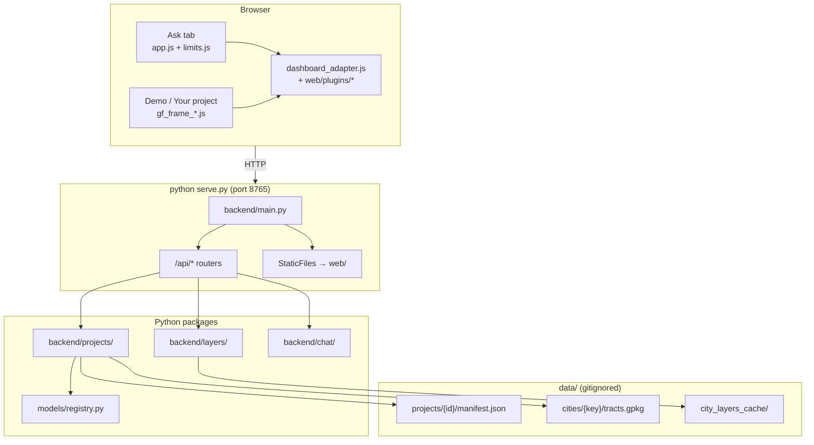
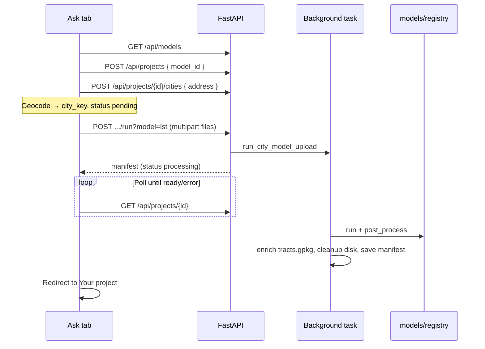

# Architecture

Geospatial GUI is a **terminal-launched** web application: one Python process (`serve.py` → uvicorn) serves a static frontend (`web/`) and a FastAPI backend (`backend/` + `models/`). There is no separate database — projects, caches, and tract layers live on disk under `data/`.

The system is built around a **dual plugin model**: analysis pipelines register in `models/` (backend) and presentation registers in `web/plugins/` (frontend). Both sides share the same model id (`lst`, `obia`, …) and are merged at runtime via `GET /api/models` + `web/dashboard_adapter.js`.

## Design principles

| Principle | What it means in practice |
|-----------|---------------------------|
| **Pluggable models** | New analysis types add a `ModelSpec` + frontend plugin without rewriting the Ask tab or dashboard shell. |
| **File-backed state** | `data/projects/{id}/manifest.json` is the source of truth for multi-city portfolios; the browser keeps one active project id in `localStorage`. |
| **Background runs** | Model execution is a FastAPI background task; the Ask tab polls `GET /api/projects/{id}` until a city is `ready` or `error`. |
| **GPKG as canonical vector** | Enriched tracts persist as `tracts.gpkg`; GeoJSON is derived on demand for MapLibre and chat. |
| **Disk-conscious defaults** | After a successful run, raw uploads and pipeline intermediates are deleted unless retention env vars opt in ([`backend/core/storage.py`](../backend/core/storage.py)). |
| **Graceful AI fallback** | Chat tries Ollama first; deterministic summaries answer when the LLM is unreachable or rate-limited. |

## Runtime topology



**Boot sequence:** `serve.py` loads `.env` (without overwriting existing shell vars), verifies the expected `web/` layout, prints registered model ids, then starts uvicorn on `backend.main:app`.

---

## Application tabs

| Tab | Primary frontend | Key API routes | Purpose |
|-----|------------------|----------------|---------|
| **Ask** | `web/app.js`, `web/limits.js`, `web/dashboard_adapter.js` | `GET /api/config`, `GET /api/models`, `POST /api/projects/*` | Pick model → add city → upload → run analysis |
| **Demo** | `web/gf_frame.js`, `web/gf_frame_*.js` | `GET /api/city-layers/demo-portfolio` | 11-city Heat & Equity preview (placeholder LST) |
| **Your project** | `web/gf_frame.js`, `web/gf_frame_*.js`, `web/dashboard_adapter.js` | `GET /api/projects/{id}`, `POST /api/followup`, `POST /api/projects/{id}/report` | Adapter-driven dashboard after ≥1 city is `ready` |

**Your project** unlocks in the sidebar when the active portfolio has at least one ready city. **Demo** warm-up prefetches city-layer payloads only in Demo mode (not when viewing Your project).

---

## Plugin architecture

### Backend (`models/`)

Each model is a `ModelSpec` ([`models/contract.py`](../models/contract.py)):

| Hook | Role |
|------|------|
| `input_schema` | Describes uploads; exposed on Ask via `GET /api/models` |
| `run(paths, ctx)` | Executes the pipeline → `ModelResult` (stats, logs, artifacts) |
| `post_process(result, ctx)` | Optional tract enrichment → writes `tracts.gpkg`, sets `vector_fields` |
| `dashboard` | Shell type (`equity` today — Heat & Equity frame) |
| `primary_metric` / `vector_fields` | Keys for charts, legend, and chat |

Models register in [`models/registry.py`](../models/registry.py). Dispatch is a thin call chain:

```
POST .../run?model={id}
  → backend/api/routes/projects.py (save uploads, queue background task)
  → backend/projects/service.py (run_city_model_upload)
  → backend/projects/dispatch.py (run_model)
  → models/registry.py (ModelSpec.execute → run + post_process)
```

Registered today: **`lst`** (Land Surface Temperature), **`obia`** (OBIA land cover). See [MODELS.md](MODELS.md) for pipeline details.

### Frontend (`web/plugins/`)

Each model has a companion plugin ([`web/model_plugin.js`](../web/model_plugin.js)) registered in [`web/dashboard_adapter.js`](../web/dashboard_adapter.js). Plugins own presentation: choropleth field, legend, stats cards, tract popups, Ask progress labels (`runVerb`, `runProgressStart`, `runProgressWorking`).

`dashboard_adapter.js` fetches `GET /api/models` and **merges** API metadata with each plugin's `presentation` object so the UI stays in sync with the registry.

---

## Backend layout

```
backend/
  main.py                 # App factory: routers + static web/
  config.py               # Paths: data/, projects/, city_layers_cache/

  api/
    deps.py               # Client IP, rate limiter, preview helpers
    routes/
      config.py           # GET /api/config (limits for the UI)
      models.py           # GET /api/models
      projects.py         # /api/projects/*
      reports.py          # POST /api/projects/{id}/report (PDF)
      city_layers.py      # /api/city-layers/*
      followup.py         # POST /api/followup

  core/
    limits.py             # Upload + chat limits (env → bytes/counts)
    storage.py            # Post-run disk cleanup, scrub artifact paths from manifest
    uploads.py            # Chunked multipart reads with size enforcement (413)
    rate_limit.py         # In-memory per-IP chat throttle
    presets.py            # 11 demo cities (names, colors, placeholder LST)
    schemas.py            # Pydantic request/response models
    constants.py          # Shared layer names, field lists

  projects/
    service.py            # Manifest CRUD, city registration, model runs
    dispatch.py           # Registry dispatch wrapper
    compare.py            # Cross-city comparison for chat

  layers/
    orchestrator.py       # Geocode → tracts → ACS → vector URLs
    geocode.py            # Census Geocoder → Nominatim → demo centroids
    tracts.py             # TIGER shapefiles (cached per state)
    census.py             # ACS 5-year tract demographics
    tract_query.py        # Structured tract attribute queries for chat
    map_render.py         # Optional server-side choropleth PNGs

  chat/
    ollama.py             # HTTP client for local Ollama /api/chat
    dashboard.py          # Follow-up Q&A grounded in dashboard context
    equity_burden.py      # Heat-equity burden ranking
    layer_correlation.py  # Tract-level Pearson correlations (LST vs demographics)

  pipelines/
    lst_zonal.py          # LST → tract zonal join
    obia_zonal.py         # OBIA → tract dominant class
    raster_util.py        # Shared raster helpers

  report/
    pdf.py                # On-demand PDF export (fpdf2)
```

---

## Cross-cutting services

### Limits and config

[`backend/core/limits.py`](../backend/core/limits.py) centralizes env-driven caps. [`GET /api/config`](API.md) exposes them to the browser (`Cache-Control: no-store`); [`web/limits.js`](../web/limits.js) validates Ask uploads and chat question length client-side before requests.

| Concern | Server enforcement | Client hint |
|---------|-------------------|-------------|
| Upload size | `backend/core/uploads.py` → **413** | `limits.js` + labels in `app.js` |
| Chat length | `followup.py` → **400** | `limits.js` |
| Chat rate | `backend/core/rate_limit.py` → **429** | shown in config (informational) |

### Post-run storage

After a successful model run, [`cleanup_city_after_success()`](../backend/core/storage.py) removes by default:

- Raw uploads (`uploads/`)
- LST intermediates (`uploads/results/`)
- OBIA intermediates (`obia_output/`)
- Legacy duplicate `tracts.geojson`

[`scrub_artifact_paths()`](../backend/core/storage.py) strips on-disk paths from persisted `run_stats`. Opt in to retention with `KEEP_UPLOADS_AFTER_RUN` or `KEEP_INTERMEDIATE_ARTIFACTS` in `.env`.

### Vector serving

| Context | Canonical file | GeoJSON endpoint |
|---------|----------------|------------------|
| Demo / city-layers cache | `city_layers_cache/gpkg/{key}.gpkg` | `GET /api/city-layers/vector/{token}/geojson` |
| Project city (ready) | `data/projects/.../tracts.gpkg` | `GET /api/projects/{id}/cities/{key}/geojson` |

Both paths derive GeoJSON from GPKG at serve time when no sidecar `.geojson` exists.

---

## Project lifecycle (Ask → Your project)



**City status values:** `pending` → `processing` → `ready` | `error`

**Ask workflow (two steps):**

1. **Add city to project** — registers address; locks `model_id` after the first city in a portfolio.
2. **Run analysis** — button appears after step 1; uploads files and starts the background run.

The active `project_id` is stored in browser `localStorage`. There is no list-all-projects API — one portfolio at a time.

---

## City layers pipeline (Demo tab)

[`backend/layers/orchestrator.py`](../backend/layers/orchestrator.py) drives Heat & Equity base layers:

1. **Geocode** (`geocode.py`) — Census Geocoder → Nominatim fallback → demo centroids → reverse geocode for county FIPS
2. **Tracts** (`tracts.py`) — tract polygons from cached TIGER shapefiles (per state)
3. **Demographics** (`census.py`) — ACS 5-year variables merged into tract features
4. **Vector layer** — GPKG written once per city; API returns `geojson_url`, `gpkg_url`, `bounds_wgs84`
5. **Map previews** (`map_render.py`) — optional PNG choropleths when `CITY_LAYERS_RENDER_PNG=true`

`GET /api/city-layers/demo-portfolio?warm=true` caches full payloads for all 11 preset cities under `data/city_layers_cache/demo_snapshots/`.

---

## Follow-up chat pipeline

`POST /api/followup` enriches `DashboardContext` before calling Ollama ([`backend/chat/dashboard.py`](../backend/chat/dashboard.py)):

| Step | Module | When |
|------|--------|------|
| Validate question length | `followup.py` + `limits.py` | Always |
| Rate limit | `rate_limit.py` | Always |
| Cross-city comparison | `projects/compare.py` | `project_id` or `demo_cities` in context |
| Tract attribute query | `layers/tract_query.py` | `tract_layer_token` set |
| Equity burden ranking | `chat/equity_burden.py` | Question matches burden keywords (LST projects) |
| Layer correlations | `chat/layer_correlation.py` | Correlation-style questions (Pearson r across tract fields) |
| LLM answer | `chat/ollama.py` | `OLLAMA_ENABLED=true` and reachable |
| Deterministic fallback | `chat/dashboard.py` | Ollama off or unreachable |

Context includes `analysis_model` (registry id) when viewing a project dashboard so answers reference the correct metrics.

---

## Frontend modules

| File | Role |
|------|------|
| `web/index.html` | Shell: sidebar tabs, page containers, script load order |
| `web/app.js` | Ask tab: model select, two-step add/run, upload UI, progress polling |
| `web/limits.js` | Fetches `/api/config`; client-side upload and chat validation |
| `web/dashboard_adapter.js` | ES module: merges API models with frontend plugins |
| `web/model_plugin.js` | Plugin factory and hook defaults |
| `web/plugins/lst_plugin.js` | LST presentation, legend, tract popup |
| `web/plugins/obia_plugin.js` | OBIA presentation and rendering hooks |
| `web/gf_frame.js` | Dashboard shell bootstrap, tab activation |
| `web/gf_frame_shared.js` | Shared state, top bar, adapter wiring, project load |
| `web/gf_frame_map.js` | MapLibre map, layers, legend, tract popups, cross-city LST scale |
| `web/gf_frame_chat.js` | Query panel, follow-up chat, PDF export trigger |

Map rendering uses **MapLibre GL** with tract GeoJSON loaded from the vector URLs in the manifest or city-layers response.

---

## Extension points

To add analysis model #3, touch these integration surfaces (full walkthrough: [ADDING_A_MODEL.md](ADDING_A_MODEL.md)):

| Layer | Files |
|-------|-------|
| Pipeline | `models/your_model.py` → register in `models/registry.py` |
| Tract join | `backend/pipelines/your_zonal.py` (if `vector_join: tract_zonal`) |
| Presentation | `web/plugins/your_model_plugin.js` → register in `dashboard_adapter.js` |
| Docs | [MODELS.md](MODELS.md), [API.md](API.md) |

Models with `dashboard: "equity"` reuse the Heat & Equity frame. A future `raster` dashboard type would need a dedicated map shell.

---

## Related docs

| Doc | Contents |
|-----|----------|
| [ADDING_A_MODEL.md](ADDING_A_MODEL.md) | End-to-end guide for new models |
| [MODELS.md](MODELS.md) | LST and OBIA pipeline details |
| [API.md](API.md) | Endpoint reference |
| [DATA.md](DATA.md) | On-disk layout, caches, env vars |
